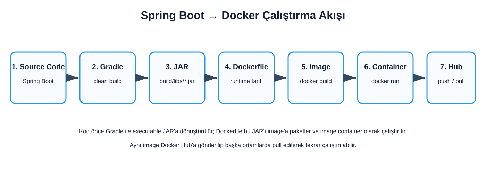
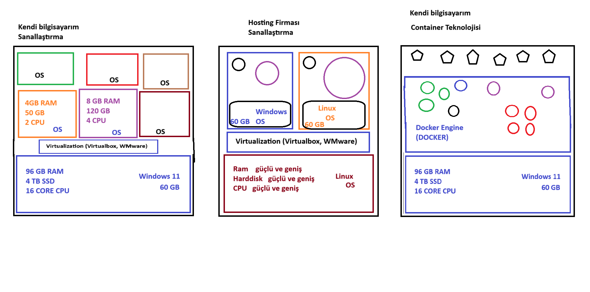
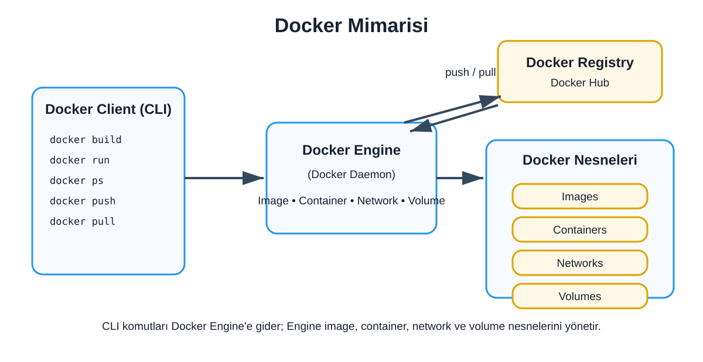
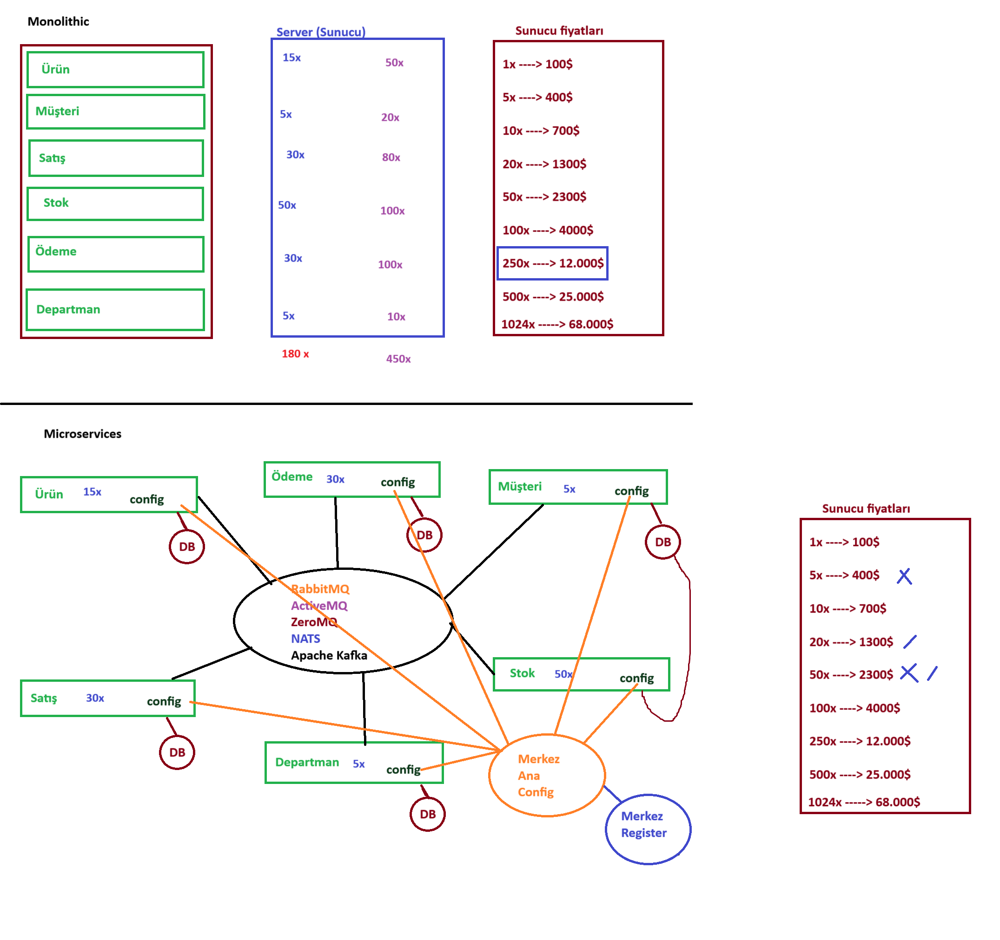

# Java 42 — Spring Boot & Docker

Bu proje, basit bir **Spring Boot** uygulamasını kullanarak Docker'ın temel kavramlarını uygulamalı biçimde öğrenmek amacıyla hazırlanmıştır. Uygulamanın iş mantığından çok, Java uygulamasının **JAR → Docker Image → Docker Container → Docker Hub** akışı üzerinde durulmaktadır.

## İçindekiler

- [Projenin Amacı](#projenin-amacı)
- [Docker Nedir?](#docker-nedir)
- [Sanal Makine ve Container Farkı](#sanal-makine-ve-container-farkı)
- [Docker Mimarisi](#docker-mimarisi)
- [Docker Image ve Container](#docker-image-ve-container)
- [Spring Boot Uygulamasını Build Etme](#spring-boot-uygulamasını-build-etme)
- [Dockerfile](#dockerfile)
- [Docker Image Oluşturma](#docker-image-oluşturma)
- [Container Çalıştırma](#container-çalıştırma)
- [Container Yaşam Döngüsü](#container-yaşam-döngüsü)
- [Docker Hub](#docker-hub)
- [Docker ve Microservices İlişkisi](#docker-ve-microservices-ilişkisi)
- [.dockerignore](#dockerignore)
- [Sık Kullanılan Docker Komutları](#sık-kullanılan-docker-komutları)

---

## Projenin Amacı

Bu repository içindeki Spring Boot uygulaması, Docker konularını deneyebilmek için kullanılan küçük bir örnek uygulamadır. Proje kapsamında temel olarak aşağıdaki akış uygulanır:

```text
Spring Boot Source Code
        ↓
Gradle Build
        ↓
Executable JAR
        ↓
Dockerfile
        ↓
Docker Image
        ↓
Docker Container
        ↓
Docker Hub
```



Kullanılan temel teknolojiler:

- Java 21
- Spring Boot
- Gradle
- Docker Desktop
- Eclipse Temurin
- Docker Hub

---

## Docker Nedir?

Docker, uygulamaların bağımlılıklarıyla birlikte **container** adı verilen izole çalışma ortamlarında paketlenmesini ve çalıştırılmasını sağlayan bir container platformudur.

Bir Java uygulamasını klasik yöntemle başka bir bilgisayara taşıdığımızda hedef ortamda uygun Java sürümü, gerekli bağımlılıklar ve doğru çalışma ayarlarının bulunması gerekir. Docker yaklaşımında ise uygulamanın çalışacağı ortam bir **Docker Image** içerisinde tarif edilir.

Bu sayede geliştirme, test ve sunucu ortamlarında aynı image kullanılabilir ve "benim bilgisayarımda çalışıyordu" türündeki ortam farkları azaltılabilir.

Docker'ın temel fikri şöyledir:

```text
Uygulama + Runtime + Bağımlılıklar
                ↓
            Docker Image
                ↓
            docker run
                ↓
          Docker Container
```

---

## Sanal Makine ve Container Farkı

Sanal makine (Virtual Machine) ve container aynı şey değildir.

Sanal makinelerde her VM genellikle kendi **guest işletim sistemini** çalıştırır. Hypervisor fiziksel donanım üzerinde birden fazla sanal makinenin çalışmasını sağlar. Bu güçlü bir izolasyon sağlar; ancak her VM'in ayrı işletim sistemi bulunması CPU, RAM ve disk açısından ek maliyet oluşturur.

Container yaklaşımında ise uygulamalar işletim sistemi seviyesinde izole edilir. Linux container'larında izolasyon ağırlıklı olarak **namespaces** ve kaynak kontrolü için **cgroups** gibi kernel özelliklerine dayanır. Her container için ayrı bir tam işletim sistemi açılması gerekmez.



> **Windows notu:** Docker Desktop üzerinde Linux container çalıştırıldığında container'lar doğrudan Windows kernel'ini paylaşmaz. Docker Desktop yaygın olarak WSL2 tabanlı hafif bir Linux ortamı üzerinden Linux container'larını çalıştırır.

Basitleştirilmiş karşılaştırma:

| Özellik | Virtual Machine | Container |
|---|---|---|
| İşletim sistemi | Her VM'de ayrı guest OS | Ortak kernel üzerinde izolasyon |
| Başlatma | Görece daha ağır | Genellikle çok hızlı |
| Boyut | Genellikle büyük | Genellikle daha küçük |
| İzolasyon | VM seviyesinde | Process / OS seviyesinde |
| Taşınabilirlik | Image ile mümkün | Container image ile çok pratik |

Container'lar sanal makinelerin yerine her durumda kullanılmaz. İki teknoloji farklı izolasyon ve çalışma ihtiyaçlarına göre birlikte de kullanılabilir.

---

## Docker Mimarisi

Docker, istemci-sunucu yaklaşımına benzer bir mimari kullanır. Kullanıcı terminalde `docker` komutlarını çalıştırır; Docker CLI bu istekleri Docker Engine'e iletir.



Temel bileşenler:

### Docker Client

Terminalde kullandığımız Docker CLI'dır.

```bash
docker build
docker run
docker ps
docker images
docker push
docker pull
```

### Docker Engine / Docker Daemon

Image, container, network ve volume gibi Docker nesnelerini yöneten temel servis katmanıdır.

### Docker Registry

Docker image'larının saklandığı merkezi veya özel depodur. **Docker Hub** en yaygın public registry örneklerinden biridir.

### Docker Objects

Docker Engine'in yönettiği temel nesneler şunlardır:

- **Image:** Uygulama için immutable paket / şablon.
- **Container:** Image'ın çalışan instance'ı.
- **Network:** Container'ların birbirleriyle ve dış dünya ile iletişimini sağlar.
- **Volume:** Container yaşam döngüsünden bağımsız kalıcı veri saklamak için kullanılır.

---

## Docker Image ve Container

Image ve container birbirinden farklı kavramlardır.

```text
Dockerfile
    ↓
docker build
    ↓
Docker Image
    ↓
docker run
    ↓
Docker Container
```

**Docker Image**, uygulamayı çalıştırmak için gerekli dosyaları ve katmanları içeren salt-okunur bir şablondur.

**Docker Container** ise bu image'ın çalışan örneğidir. Aynı image'dan birden fazla container oluşturulabilir:

```text
                ┌── Container 1
Docker Image ───┼── Container 2
                └── Container 3
```

Bu projede image adı örnek olarak şöyledir:

```text
aydindemir/java-42-hello-docker:v001
```

Burada:

- `aydindemir` → Docker Hub kullanıcı / namespace adı
- `java-42-hello-docker` → repository / image adı
- `v001` → image tag'i

---

## Spring Boot Uygulamasını Build Etme

Proje **Gradle** kullanmaktadır.

Windows CMD:

```cmd
gradlew.bat clean build
```

PowerShell:

```powershell
.\gradlew.bat clean build
```

Başarılı build sonunda:

```text
BUILD SUCCESSFUL
```

görülür.

Gradle tarafından oluşturulan dosyalar:

```text
build/libs/
```

altında bulunur.

Bu projede `build.gradle` sürümü `1.0.2` olduğu için executable Spring Boot JAR dosyası örneğin:

```text
build/libs/java-42-hello-docker-1.0.2.jar
```

şeklinde oluşur.

Spring Boot / Gradle aynı klasörde `-plain.jar` ile biten ek bir JAR da üretebilir. Docker image oluştururken **executable Spring Boot JAR** kullanılmalıdır; `plain.jar` kullanılmaz.

---

## Dockerfile

Projede kullanılan Dockerfile:

```dockerfile
FROM eclipse-temurin:21-jre

WORKDIR /app

ARG JAR_FILE

COPY ${JAR_FILE} application.jar

EXPOSE 8080

ENTRYPOINT ["java", "-jar", "application.jar"]
```

### `FROM`

```dockerfile
FROM eclipse-temurin:21-jre
```

Image'ın temel katmanını belirler. Uygulama derlenmiş JAR olarak image'a kopyalandığı için container içerisinde tekrar Java derlemesi yapılmaz; bu nedenle **JRE** runtime için yeterlidir.

### `WORKDIR`

```dockerfile
WORKDIR /app
```

Container içindeki çalışma dizinini `/app` olarak belirler.

### `ARG`

```dockerfile
ARG JAR_FILE
```

`docker build` sırasında dışarıdan JAR yolunun verilmesini sağlar.

### `COPY`

```dockerfile
COPY ${JAR_FILE} application.jar
```

Host tarafındaki JAR dosyasını image içine `application.jar` adıyla kopyalar.

### `EXPOSE`

```dockerfile
EXPOSE 8080
```

Uygulamanın container içerisinde 8080 portunu dinlediğini belgeler. **Tek başına host makinede port açmaz.** Host-container port eşlemesi `docker run -p` ile yapılır.

### `ENTRYPOINT`

```dockerfile
ENTRYPOINT ["java", "-jar", "application.jar"]
```

Container başladığında çalıştırılacak ana process'i tanımlar.

---

## Docker Image Oluşturma

Önce uygulama build edilir:

```cmd
gradlew.bat clean build
```

Ardından Docker image oluşturulur:

```cmd
docker build --build-arg JAR_FILE=build/libs/java-42-hello-docker-1.0.2.jar -t aydindemir/java-42-hello-docker:v001 .
```

Buradaki önemli parçalar:

```text
--build-arg JAR_FILE=...   → Dockerfile'daki ARG değerini verir
-t                         → Image repository ve tag bilgisini tanımlar
.                          → Docker build context olarak mevcut klasörü kullanır
```

Image'ları listelemek için:

```bash
docker image ls
```

veya:

```bash
docker images
```

---

## Container Çalıştırma

Image oluşturulduktan sonra container başlatılabilir:

```cmd
docker run --name java-42-hello-docker -p 8080:8080 aydindemir/java-42-hello-docker:v001
```

Port mapping:

```text
localhost:8080
      ↓
Host Port 8080
      ↓
Docker Port Mapping
      ↓
Container Port 8080
      ↓
Spring Boot Application
```

Buradaki:

```text
-p 8080:8080
```

şu anlama gelir:

```text
HOST_PORT : CONTAINER_PORT
   8080   :      8080
```

Arka planda çalıştırmak için `-d` kullanılabilir:

```cmd
docker run -d --name java-42-hello-docker -p 8080:8080 aydindemir/java-42-hello-docker:v001
```

Çalışan container'ları görmek için:

```bash
docker ps
```

Logları görmek için:

```bash
docker logs java-42-hello-docker
```

---

## Container Yaşam Döngüsü

Basit container yaşam döngüsü:

```text
Image
  ↓
docker run
  ↓
RUNNING
  ↓
docker stop
  ↓
STOPPED
  ↓
docker start
  ↓
RUNNING
  ↓
docker rm
  ↓
REMOVED
```

Temel komutlar:

```bash
docker stop java-42-hello-docker
docker start java-42-hello-docker
docker rm java-42-hello-docker
```

Container silmek image'ı silmez. Image ayrıca kaldırılmak istenirse:

```bash
docker rmi aydindemir/java-42-hello-docker:v001
```

kullanılır.

---

## Docker Hub

Docker Hub, container image'larının saklanabildiği bir **container registry** hizmetidir.

Temel akış:

```text
Source Code
    ↓
Gradle Build
    ↓
JAR
    ↓
Docker Build
    ↓
Local Docker Image
    ↓
docker push
    ↓
Docker Hub
    ↓
docker pull
    ↓
Başka Bilgisayar / Sunucu
    ↓
docker run
```

Docker Hub'a giriş:

```bash
docker login
```

Image'ı gönderme:

```bash
docker push aydindemir/java-42-hello-docker:v001
```

Başka bir makinede image'ı indirme:

```bash
docker pull aydindemir/java-42-hello-docker:v001
```

ve çalıştırma:

```bash
docker run -p 8080:8080 aydindemir/java-42-hello-docker:v001
```

Bu durumda hedef makinede projenin kaynak kodunun veya Gradle'ın bulunması gerekmez; Docker Engine ve erişilebilir image yeterlidir.

---

## Docker ve Microservices İlişkisi

Docker sadece microservice mimarilerinde kullanılmaz. **Monolitik uygulamalar da container olarak paketlenebilir.**

Bununla birlikte microservice mimarisinde servislerin bağımsız olarak:

- build edilmesi,
- deploy edilmesi,
- versionlanması,
- ölçeklenmesi,
- gerektiğinde farklı runtime bağımlılıklarıyla çalışması

istendiğinden container yaklaşımı bu mimariyle oldukça iyi uyum sağlar.



Örneğin bir sistemde:

```text
Product Service  → Container
Customer Service → Container
Order Service    → Container
Payment Service  → Container
Stock Service    → Container
```

şeklinde bağımsız deployment birimleri oluşturulabilir.

Burada Docker servislerin nasıl haberleşeceğini veya microservice mimarisinin kendisini belirlemez. Message broker, service discovery, centralized configuration, API Gateway ve observability gibi konular ayrı mimari bileşenlerdir.

---

## `.dockerignore`

`.dockerignore`, Docker build sırasında gereksiz dosyaların build context içerisine gönderilmesini engeller.

Bu projede örneğin Git metadata'sı, IDE dosyaları, kaynak kod ve Gradle cache'i image build için gerekli değildir. Buna karşılık `build/libs` altındaki executable JAR gereklidir.

Örnek:

```dockerignore
.git/
.idea/
.settings/
.gradle/
src/
gradle/

build/*
!build/libs/
!build/libs/*.jar

docs/
*.png
```

Daha küçük build context genellikle daha hızlı ve daha temiz Docker build süreçleri sağlar.

---

## Sık Kullanılan Docker Komutları

| Amaç | Komut |
|---|---|
| Docker sürümünü göster | `docker version` |
| Image'ları listele | `docker image ls` |
| Çalışan container'ları listele | `docker ps` |
| Tüm container'ları listele | `docker ps -a` |
| Image oluştur | `docker build -t image:tag .` |
| Container çalıştır | `docker run image:tag` |
| Port map ederek çalıştır | `docker run -p 8080:8080 image:tag` |
| Arka planda çalıştır | `docker run -d image:tag` |
| Container loglarını göster | `docker logs <container>` |
| Container durdur | `docker stop <container>` |
| Container başlat | `docker start <container>` |
| Container sil | `docker rm <container>` |
| Image sil | `docker rmi <image>` |
| Docker Hub'a giriş | `docker login` |
| Image gönder | `docker push image:tag` |
| Image indir | `docker pull image:tag` |

---

## Sonuç

Bu projede basit bir Spring Boot uygulaması üzerinden Docker'ın temel çalışma modeli uygulanmıştır:

```text
Code → Gradle → JAR → Dockerfile → Image → Container → Docker Hub
```

Bu temel akış; daha sonraki aşamalarda Docker Compose, container network'leri, volume'lar, health check'ler, multi-stage build, private registry, CI/CD ve Kubernetes gibi konuların anlaşılması için temel oluşturur.
