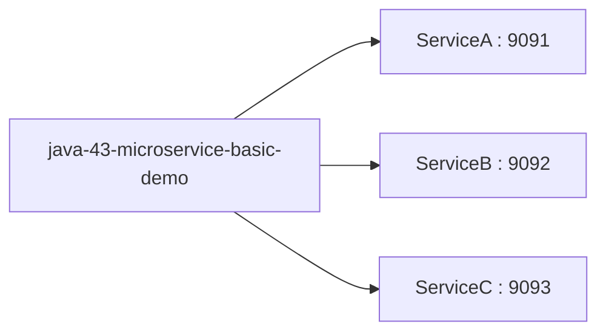

# Microservices - Modules

Bu proje, Gradle multi-module yapısında üç bağımsız Spring Boot servisini birlikte yönetmeyi göstermek için hazırlanmıştır.

## Servis adresleri

- ServiceA: http://localhost:9091/
- ServiceB: http://localhost:9092/
- ServiceC: http://localhost:9093/

## Info endpointleri

- ServiceA: http://localhost:9091/info
- ServiceB: http://localhost:9092/info
- ServiceC: http://localhost:9093/info

## Swagger UI

- ServiceA: http://localhost:9091/swagger-ui/index.html
- ServiceB: http://localhost:9092/swagger-ui/index.html
- ServiceC: http://localhost:9093/swagger-ui/index.html

## OpenAPI JSON

- ServiceA: http://localhost:9091/v3/api-docs
- ServiceB: http://localhost:9092/v3/api-docs
- ServiceC: http://localhost:9093/v3/api-docs
